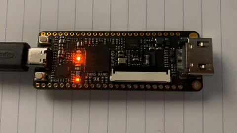

# A very basic "Knight Rider" for TangNano 9k

This is a hello world program for TangNano 9k board:

It is somewhat inspired by:

- https://github.com/SpacePirate/KnightRider
- https://zipcpu.com/blog/2017/05/20/knight-rider.html
- https://github.com/sipeed/TangNano-9K-example

## Pre-requisites

- openFPGALoader: https://github.com/trabucayre/openFPGALoader
- Gowin IDE: https://wiki.sipeed.com/hardware/en/tang/Tang-Nano-Doc/install-the-ide.html

Note: Just the IDE. For "programming" I use openFPGALoader.

## Compiling / flashing

1. Adjust paths to `gw_sh` and `openFPGALoader` in `Makefile`
1. `make`

If you're happy with it `make permaflash` to burn it to flash (instead of sdram).
